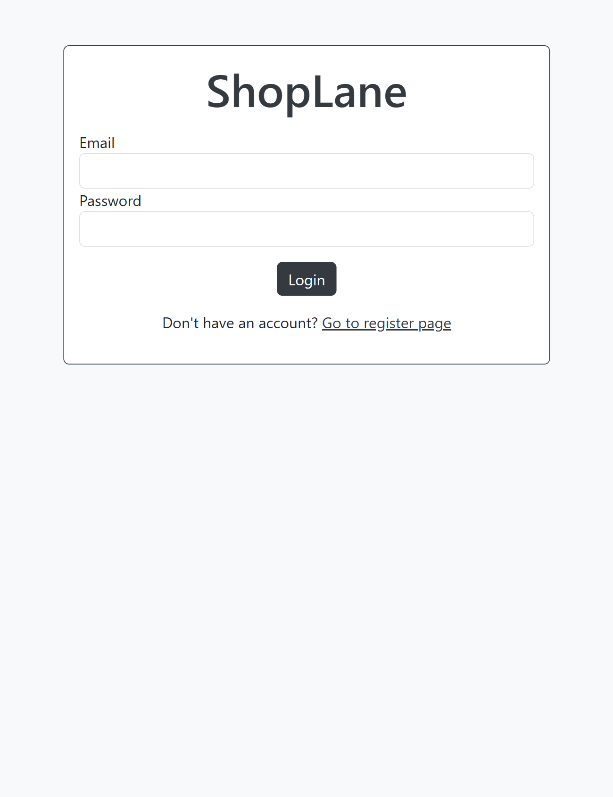
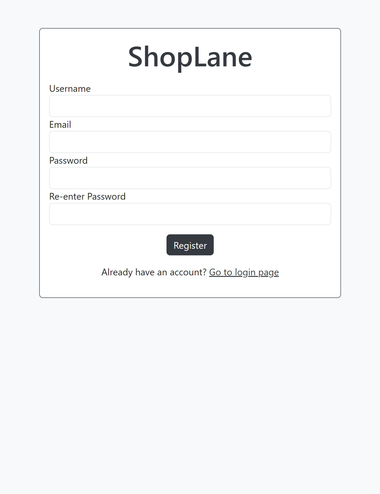
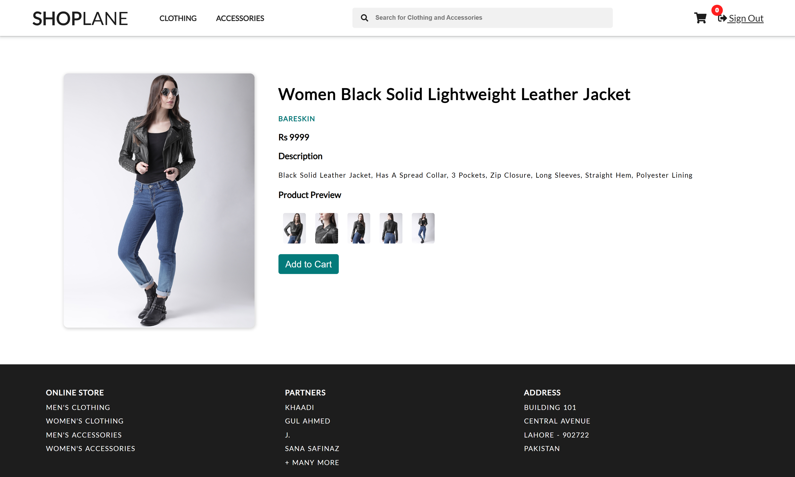
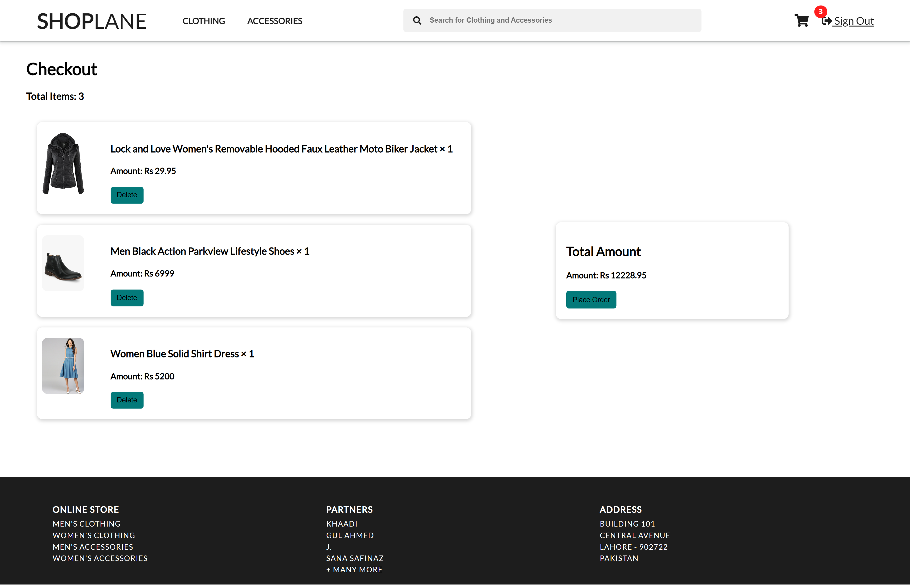
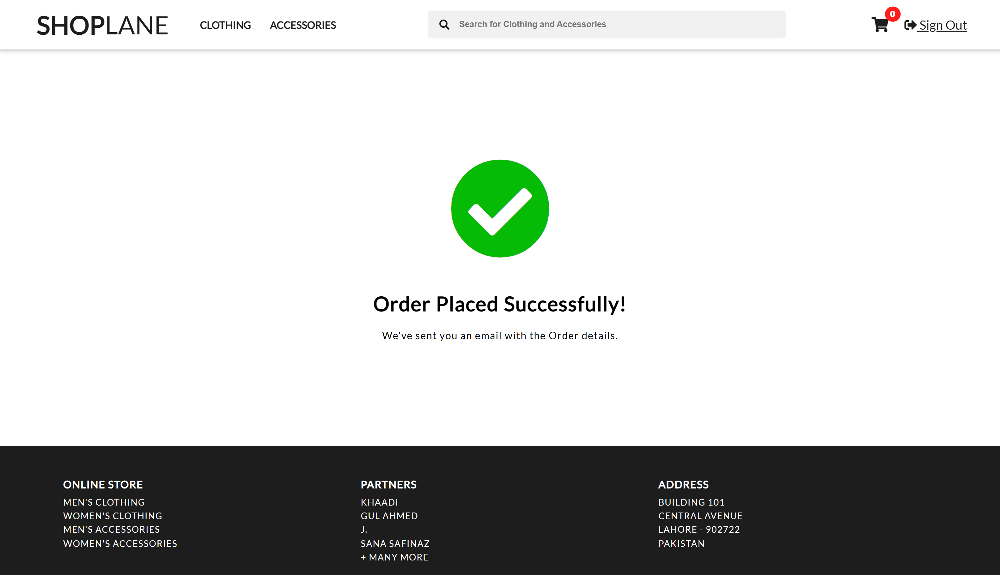

# E-commerce Website

Welcome to the E-commerce Website repository! This project is built using HTML, CSS, and JavaScript. It includes all the essential features of an e-commerce platform, such as product listings, a shopping cart, and a checkout process.

## Features

- **Login & Signup Pages:** Secure user authentication and registration.
- **Home Page:** Dynamic slider and featured product categories.
- **Product Pages:** Categories for men’s and women’s clothes and accessories.
- **Product Detail Pages:** Detailed view of each product with the option to add to cart.
- **Shopping Cart:** Dynamic cart with item counter, overview, and deletion functionality.
- **Checkout Page:** Final review and payment process.

## API Integration

The project utilizes the following APIs to fetch product data:

- **MockAPI** for some of the products.
- **FakeStoreAPI** for additional product data.

## Screenshots

### 1. Home Page


### 2. Login Page



### 3. Signup Page



### 4. Product Detail Page



### 5. Cart Page



### 6. Checkout Page



## Installation

1. Clone the repository:
   ```bash
   git clone https://github.com/Abdur-Rehman-643/ecommerce-website.git
   ```
